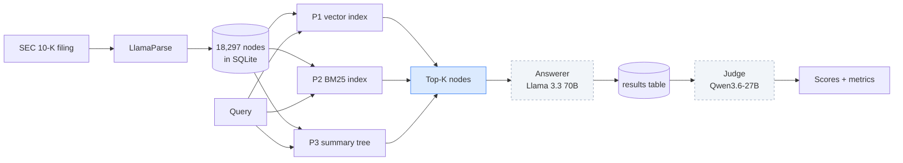

# The code demo, explained

A companion to `presentation.pptx`. This covers what the demo script actually does, what it deliberately leaves out, and how to talk about both without overstating anything.

Read the first three sections before filming. The rest is there for questions.

---

## 1. The short version

The demo runs **retrieval only**. It is stage one of a three-stage system.

| Stage | What happens | In the demo? |
|---|---|---|
| 1. Retrieve | Find the most relevant chunks of the filing | Yes |
| 2. Answer | Send those chunks to an LLM, get a cited answer | No |
| 3. Judge | Score that answer against the ground truth | No |

Stages 2 and 3 both need API quota and neither has been run yet. The `results` table currently holds **0 rows**.

> If someone asks why there's no answer text or judge verdict on screen, the honest reply is: *"the demo shows the retrieval layer, which is the part the dissertation actually compares. Answer generation and judging are separate passes and they haven't been run."*

---

## 2. The whole system, end to end



Solid box in blue is what the demo covers. The two dashed boxes are built and tested, but not yet run.

### Why the split matters

The whole point of the study is to compare **retrieval strategies**, not answer writers. So everything downstream of retrieval is held constant: same Answerer model, same prompt, same judge, same temperature of 0. If P1 scores better than P2, the only thing that could have caused it is the retrieval.

That design choice is what makes the demo legitimate on its own. Retrieval is the independent variable.

---

## 3. What the demo does, step by step

Command:

```bash
cd project
uv run python -m demo.main
```

Optional flags: `--document-id MSFT_2023` and `--k 3`.

### Step 1: check the indexes

`demo/indexes.py` looks on disk for three things:

- `storage/summary_index/MSFT_2023`: the P3 tree. Built once in Phase 3 by an LLM. Cannot be rebuilt offline, so the demo refuses to run without it.
- `storage/bm25/MSFT_2023.pkl`: the BM25 corpus. Builds in about a tenth of a second if missing.
- `storage/chroma/MSFT_2023`: the vector store. Takes roughly 74 seconds to build if missing, because every node has to be embedded.

All three already exist for MSFT_2023, so the run is instant.

### Step 2: load the retrievers

`demo/compare.py` constructs all three retriever objects. P1 goes last on purpose: it loads two ONNX models (the embedder and the reranker) and is the slow one.

### Step 3: run four queries

The demo picks **one query per difficulty quadrant**, all from the same filing:

| Quadrant | What it tests |
|---|---|
| Q1 Direct Text | The answer is written out in a paragraph |
| Q2 Implicit Text | The answer needs a step of reasoning over prose |
| Q3 Direct Table | The answer is a figure sitting in a table |
| Q4 Implicit Table | The answer needs arithmetic across table cells |

Each query goes to all three pipelines. Same question, same K, different strategy. Then the script scores what came back and prints it.

### Why MSFT_2023 is pinned

Two reasons, both practical:

- It is the only filing carrying a query in all four quadrants, so one filing covers the full difficulty spread.
- P1 and P2 build indexes per document, so demoing one filing means one build rather than thirteen.

---

## 4. The three pipelines in plain terms

### P1: semantic

Every chunk of the filing gets turned into a list of numbers (an embedding) that captures its meaning. The question gets the same treatment. The system then finds the chunks whose numbers sit closest to the question's numbers.

Two models, both running locally on CPU:

- `bge-small-en-v1.5` does the embedding.
- `bge-reranker-base` is a cross-encoder. It takes the top 20 candidates and re-reads each one alongside the question to reorder them properly.

The reranker is why P1 takes about 5 seconds a query. It is doing real work, twenty times over.

Strength: understands paraphrase. Ask "what does the company say about staff numbers" and it can find a paragraph that says "we employed 221,000 people" without the word "staff" appearing anywhere.

Weakness: it can be confidently wrong. Two passages about the same topic look similar in embedding space even when only one of them holds the answer.

### P2: statistical

No model at all. BM25 is a formula from the 1990s that scores documents by word overlap, weighted so rare words count more than common ones.

Two details worth knowing:

- The tokeniser is custom and deliberately keeps numbers, percentages, and currency symbols. Off-the-shelf tokenisers strip those, which would be fatal on a financial filing.
- There is no stemming, so "lease" and "leases" are treated as different terms.

Strength: exact figures and named terms. If the question contains a number that appears in one table, BM25 finds that table.

Weakness: completely blind to paraphrase. Different words for the same idea score zero.

Speed: about 0.02 seconds a query. Effectively free.

> The guardrails forbid using LlamaIndex's `KeywordTableIndex` here, because it calls an LLM behind the scenes. That would destroy the whole semantic versus statistical contrast. P2 has to stay pure.

### P3: structural

An LLM read the filing section by section and wrote summaries, then summarised the summaries, building a tree. At query time the system starts at the root and walks down, picking the most similar branch at each level until it hits leaves.

Important detail for the viva: **no LLM runs at query time**. A `MockLLM` is bound deliberately when the tree is loaded, which makes a stray paid API call impossible. The traversal uses embedding similarity only.

Strength: it respects the document's structure. In principle it should route a question about properties into the properties section.

Weakness: it commits early. The choice happens near the root, where all it has to go on is a broad summary. Pick the wrong branch there and the correct leaf is unreachable. There is no way back up.

---

## 5. How the scores are worked out

No model does the scoring. It is set arithmetic, in `judge/metrics.py`.

Every query in the database carries a `gt_citations` field: the list of node IDs that genuinely contain the answer. The demo compares what each pipeline returned against that list.

**Precision@K**: of the K nodes returned, how many were correct, divided by K.

**Recall@K**: of the correct nodes that exist, how many did the pipeline find.

### Worked example, from the real run

Query 3 asked about leased facilities. Ground truth is four nodes: `n0388`, `n0389`, `n0390`, `n0391`.

P2 returned `n0389`, `n0391`, `n0056`.

```
Precision@3 = 2 correct / 3 returned  = 0.67
Recall@3    = 2 found   / 4 that exist = 0.50
```

### The precision ceiling, which is worth knowing

Look at query 1. Ground truth is a single node, `n0387`. P1 and P2 both found it, first place. Both scored 0.33.

That is not a failure. With one correct node and K set to 3, the arithmetic maximum is 1 divided by 3. The denominator is K, not the number of correct nodes that exist.

This is deliberate. It penalises a pipeline for padding its results with rubbish. But it means precision figures across quadrants are not directly comparable, because the quadrants have different ground truth sizes. In the write-up the numbers get read per quadrant, never pooled into one league table.

If a marker asks why the precision numbers look low, that is the answer, and it is a good one to have ready.

---

## 6. Reading the output on screen

```
                 ranked top-3                      P@3     R@3   latency
P1  semantic     n0387*    n0004     n1035        0.33    1.00     6.16s
P2  statistical  n0387*    n0037     n1035        0.33    1.00     0.03s
P3  structural   n0966     n0811     n0965        0.00    0.00     4.40s
```

- The node IDs are the actual chunks retrieved, in rank order.
- A star means that node is in the ground truth.
- Latency is wall-clock time for that retrieval alone.
- The line underneath counts how many distinct nodes the three pipelines returned between them. It was 7 or 8 every time, out of 9 slots, and never once did all three agree.

That last figure is the most quotable thing in the output. Three paradigms, same question, and they barely overlap. The disagreement is exactly what the benchmark exists to measure.

### About P3 scoring zero

It scored 0.00 on all four queries. Before putting that on camera it was worth checking whether the pipeline was simply broken. It is not.

P3 returned real, different, query-dependent nodes each time. On the properties questions it routed into the lease tables in Item 8, Financial Statements, rather than the facilities table in Item 2, Properties. Both sections talk about leases. The root-level summary could not tell them apart, and once P3 went down the Item 8 branch it could not recover.

That is the failure mode described in section 4, firing on camera. Say it that way. A pipeline behaving exactly as its architecture predicts is a finding, not a bug.

---

## 7. What the demo leaves out, and why

### Stage 2: the Answerer

Lives in `pipelines/answerer.py`, driven by `loop_executor.py`.

It takes the retrieved nodes and the question, sends both to Llama 3.3 70B on Groq, and gets back an answer with inline citations in the form `[[node:n0387]]`. The system prompt tells it to use only the supplied sources and to say so plainly if the answer is not there.

The answer, the cited node IDs, the latency, and the token counts all get written to one row in the `results` table.

### Stage 3: the Judge

Lives in `judge/async_judge.py`.

It reads back a `results` row and produces two kinds of score:

- **Model score**: Qwen3.6-27B grades the answer 1 to 10 against the ground truth, returning JSON with a one-sentence justification.
- **Deterministic metrics**: `token_f1`, `exact_match`, `citation_match`, `evidence_hit`. All computed in code, never delegated to the model.

The citation check in particular stays in code on purpose. Asking a model to verify citations would make the metric unreproducible.

### Two reasons the demo stops before this

- **The judge gate has not passed.** The judge must agree with human scoring on more than 80% of 60 gate outputs before its verdicts count for anything. Showing an ungated verdict would be claiming a result the methodology does not yet support.
- **A demo that spends quota can fail live.** Retrieval is local and deterministic. The same numbers come out on every take, and nothing depends on a free-tier API being up while recording.

---

## 8. The anti-cheating rules, in one place

These come up in questions, and they are the part that shows methodological care.

| Rule | What it means | Why |
|---|---|---|
| Anti-leakage | A pipeline sees the question and its own retrieved nodes. Nothing else. | No hints about where the answer lives |
| Disjoint query sets | 100 test questions, 20 for teaching the judge, 20 for validating it. No overlap. | The judge is never validated on what it was taught |
| Anti-self-grading | The Generator and Critic are different model families. So are the Answerer and Judge. | No model marks its own homework |
| No metadata pre-filter | P1 filters only on document ID, which every pipeline does | Filtering on section headers would hand P1 the answer |
| Temperature 0 everywhere | Every LLM call is deterministic, run once | Reproducible, and no cherry-picking a good sample |

### The model routing

| Role | Model | Provider |
|---|---|---|
| Generator | `nvidia/nemotron-3-super-120b-a12b:free` | OpenRouter |
| Critic | `openai/gpt-oss-20b:free` | OpenRouter |
| P3 tree build | `nvidia/nemotron-3-super-120b-a12b` | NVIDIA NIM |
| Answerer | `llama-3.3-70b-versatile` | Groq |
| Judge | `qwen/qwen3.6-27b` | Groq |

Three providers, not one, because the free tiers ran out mid-build three separate times.

---

## 9. Questions you are likely to get

**Why is BM25 beating the neural model?**

On this sample of four questions, yes. Three of them hinge on exact terms or figures pulled from tables, which is BM25's home ground. Four questions on one filing is not a result. The benchmark proper is 900 runs, and it has not been run.

**Why not use a bigger embedding model for P1?**

`bge-small-en-v1.5` runs on CPU with no API cost, which keeps the whole retrieval layer reproducible on any machine. Swapping in a larger model would change the constant, not the comparison. It is a sensible extension, not a fix.

**Is 13 filings enough?**

It started at 9 and went up to 13 for more data to work with, covering five companies. The unit of analysis is the query, not the filing, and there are 140 of those across four difficulty types. The corpus is a stated number rather than an estimate, which matters more than the number being large.

**Why has the benchmark not run yet?**

Twenty golden questions still need hand-labelling, and that gates the judge validation. Running 900 cells before the judge is validated would produce numbers nobody could defend.

**What if all three pipelines score about the same?**

That is a publishable result. It would say retrieval strategy matters less on financial filings than the literature assumes, and the finding still counts.

**How do you know P3 is not just broken?**

It returns different nodes for different queries, drawn from the correct filing, and the sections it lands on are topically adjacent to the right ones. It is choosing, and choosing wrong. The tree commits to a branch near the root, before it has enough information to choose well.

---

## 10. Commands

```bash
# the demo
cd project
uv run python -m demo.main

# a different filing (needs a summary tree already built)
uv run python -m demo.main --document-id AAPL_2023

# a different retrieval depth
uv run python -m demo.main --k 5

# the test suite
uv run pytest -q -m "not live"

# show the results table is empty
sqlite3 benchmark.db "select count(*) from results;"
```

### One thing to fix before filming

The first line of output is a warning from the `transformers` library:

```
None of PyTorch, TensorFlow >= 2.0, or Flax have been found.
```

It is harmless. The embedder uses ONNX, not PyTorch. But it reads like an error on camera, so it is worth suppressing or trimming out of the recording.

---

## 11. File map

| File | Does |
|---|---|
| `project/demo/main.py` | Entry point, prints the whole run |
| `project/demo/config.py` | Pinned settings: filing, K, quadrants |
| `project/demo/indexes.py` | Checks the three indexes exist, builds what's missing |
| `project/demo/compare.py` | Loads queries, runs retrieval, scores it |
| `project/demo/report.py` | Terminal formatting |
| `project/pipelines/vector/p1_vector.py` | P1 retriever |
| `project/pipelines/bm25/p2_bm25.py` | P2 retriever |
| `project/pipelines/structural/p3_structural.py` | P3 retriever |
| `project/pipelines/answerer.py` | Stage 2, not in the demo |
| `project/judge/async_judge.py` | Stage 3, not in the demo |
| `project/judge/metrics.py` | Precision, recall, F1, citation audit |
| `project/loop_executor.py` | The real 900-run driver |
